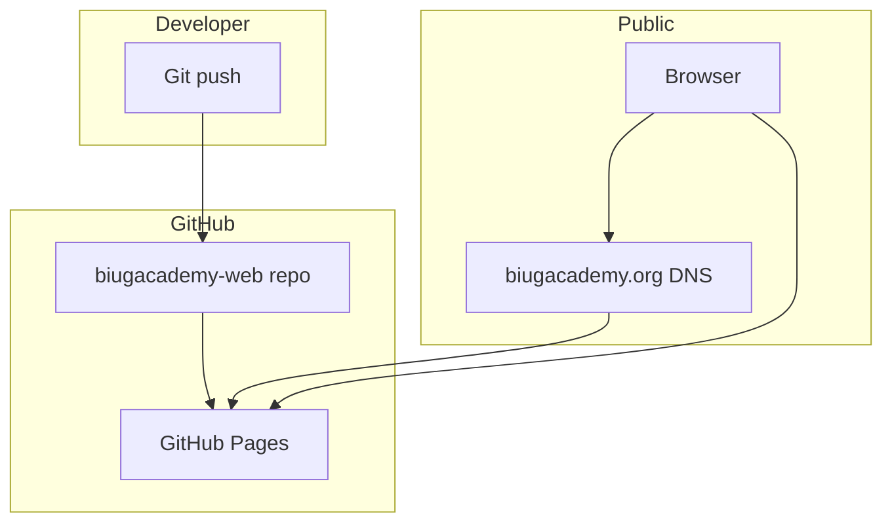
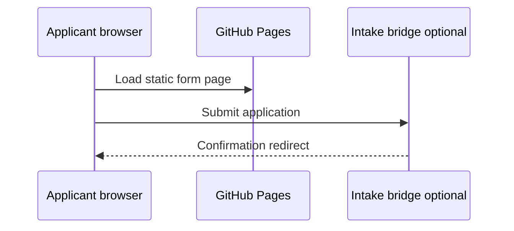
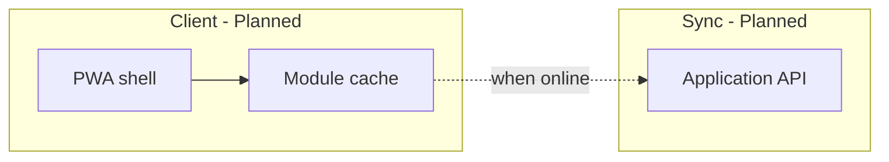

# System architecture

BIU.G Academy’s technical architecture is intentionally simple today and documented for progressive expansion. This document distinguishes **operational**, **under development**, and **planned** components.

**Website:** [https://biugacademy.org](https://biugacademy.org)

---

## Design principles

| Principle               | Rationale                                                                                      |
| ----------------------- | ---------------------------------------------------------------------------------------------- |
| **Mobile-first**        | Primary access in Angola is via smartphone                                                     |
| **Offline-first**       | Learning and content must tolerate intermittent connectivity (planned for curriculum delivery) |
| **Static-by-default**   | Minimize attack surface and hosting cost for public presence                                   |
| **Documentation-first** | Architecture changes precede public claims                                                     |
| **Human-in-the-loop**   | Admissions and AI assist remain reviewer-governed (planned)                                    |

---

## Current architecture (operational)

### Frontend structure

```text
biugacademy-web/
├── index.html              # Root → /pt/
├── pt/ en/ fr/             # Localized pages
├── css/styles.css          # Design tokens and layout
├── js/script.js            # Navigation and UI behavior
├── assets/                 # Logo and images
├── about/ programs/        # Path aliases (redirects)
├── waitlist/ thank-you/    # Intake aliases
└── CNAME                   # biugacademy.org
```

| Concern | Implementation                                     |
| ------- | -------------------------------------------------- |
| Routing | Directory-based static paths + HTML redirects      |
| Styling | CSS custom properties in `css/styles.css`          |
| i18n    | Separate locale trees; `hreflang` on primary pages |
| Forms   | Client POST to external bridge (if configured)     |

### Deployment model



- **Hosting:** GitHub Pages from default branch, root `/`
- **TLS:** Provided by GitHub Pages
- **Custom domain:** `CNAME` file in repository root

See [docs/operations/deployment-guide.md](docs/operations/deployment-guide.md).

### Optional intake bridge (operational when configured)



`google-apps-script/` documents one optional pattern. Not all environments use a bridge.

### Non-production: `backend/`

Experimental FastAPI/SQLite code may exist for local intake trials. It is **not** part of the GitHub Pages deployment and **not** described as operational infrastructure.

---

## Under development

| Component         | Direction                                                |
| ----------------- | -------------------------------------------------------- |
| Cohort operations | Manual review workflows documented in `docs/operations/` |
| Content packaging | Module outlines in `docs/curriculum/`                    |
| Documentation CI  | Markdown lint via GitHub Actions (optional)              |

---

## Planned architecture

### CMS direction (planned)

A future content management layer would support:

- Reviewed publishing workflow for curriculum updates
- Versioned modules and facilitator guides
- Separation of public marketing copy from instructional content

**Not operational today.** Static HTML remains the source of truth for the public site.

### Authentication (planned)

| Actor        | Need                            |
| ------------ | ------------------------------- |
| Learners     | Progress, offline sync (future) |
| Facilitators | Cohort management               |
| Admins       | Admissions, reporting           |

Planned properties: HTTPS-only, role-based access, no shared credentials, secrets outside the repository.

### Offline-first learning (planned)



### Analytics (planned)

Privacy-bounded metrics aligned with [docs/metrics/outcomes-framework.md](docs/metrics/outcomes-framework.md)—no production analytics pipeline today.

### Assistive AI (planned)

Human-reviewed classification and optional learning coach—see [docs/architecture/future-ai-backend.md](docs/architecture/future-ai-backend.md).

---

## Mobile-first rationale

- Layout and navigation are designed for small viewports first (`css/styles.css`).
- Forms and CTAs must remain usable on common Android screen sizes.
- Heavy assets and autoplay media are avoided on public pages.

---

## Related documents

| Document                                                                                       | Topic                    |
| ---------------------------------------------------------------------------------------------- | ------------------------ |
| [docs/architecture/website-architecture.md](docs/architecture/website-architecture.md)         | Route and stack detail   |
| [docs/architecture/data-intake-architecture.md](docs/architecture/data-intake-architecture.md) | Intake and database plan |
| [ROADMAP.md](ROADMAP.md)                                                                       | Phase timeline           |
| [docs/whitepaper/biug-academy-whitepaper-v1.md](docs/whitepaper/biug-academy-whitepaper-v1.md) | Strategic architecture   |
