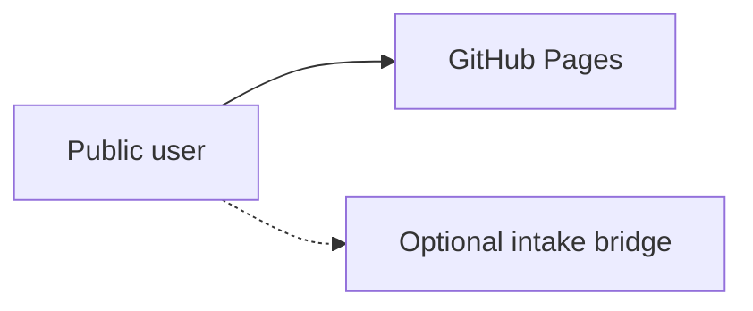

# BIU.G Academy — Education Infrastructure Repository

[](https://biugacademy.org)
[](LICENSE)
[](docs/README.md)
[](ROADMAP.md)

**Website:** [https://biugacademy.org](https://biugacademy.org)  
**Contact:** [support@biugacademy.org](mailto:support@biugacademy.org)

This repository is the **public infrastructure home** for BIU.G Academy: static website, institutional documentation, governance artifacts, and execution roadmaps. It is intended for regulators, NGOs, universities, developers, and institutional partners who need a clear, inspectable record of what exists today versus what is planned.

---

## Project overview

BIU.G Academy is an **Angola-first**, **offline-first** technical education and training initiative **under development** by Biu-g Holdings LLC. The initiative focuses on practical financial literacy, digital readiness, entrepreneurship foundations, technical pathways, and long-term workforce capability—without presenting future systems as already operational.

This is **not** a licensed university repository and **does not** confer accredited academic degrees.

---

## Mission

Develop disciplined, accessible learning infrastructure that strengthens real-economy skills for Angola and, over time, contributes to broader African digital readiness—through documentation, cohort-based delivery (planned), and transparent governance.

---

## Current status

Capabilities are labeled consistently across the repository:

| State                 | Meaning                                    |
| --------------------- | ------------------------------------------ |
| **Operational**       | Live and maintained today                  |
| **Under development** | In active design or partial implementation |
| **Planned**           | Roadmap only; not deployed                 |

### Operational

| Capability                  | Notes                                               |
| --------------------------- | --------------------------------------------------- |
| Public website              | Static site on GitHub Pages at biugacademy.org      |
| Multilingual public pages   | Portuguese (default), English, French               |
| Candidate intake path       | Application flow for **planned** first cohort       |
| Institutional documentation | `docs/`, root policies, white paper v1.0            |
| Repository governance files | CONTRIBUTING, GOVERNANCE, SECURITY, CODE_OF_CONDUCT |

### Under development

| Capability              | Notes                                      |
| ----------------------- | ------------------------------------------ |
| First cohort operations | Selection, facilitation, delivery          |
| Curriculum modules      | Financial literacy core first              |
| Documentation parity    | EN/FR alignment with PT                    |
| Metrics collection      | Framework defined; no production dashboard |
| PDF export pipeline     | Documented; automation optional            |

### Planned

| Capability                          | Notes                                      |
| ----------------------------------- | ------------------------------------------ |
| LMS / structured content system     | Phase 2+                                   |
| Offline-first learning distribution | Phase 3                                    |
| Analytics and admin dashboards      | Phase 4                                    |
| Full multilingual program parity    | Phase 5                                    |
| Formal institutional partnerships   | Phase 6                                    |
| Accredited degree pathways          | Only if lawfully established and disclosed |

**Active roadmap phase:** [Phase 0 — Public website](ROADMAP.md#phase-0--public-website--active)

---

## Architecture summary

Static HTML/CSS/JavaScript served from GitHub Pages. Optional external intake bridge for forms. Experimental backend code in `backend/` is **not** production infrastructure.

See [ARCHITECTURE.md](ARCHITECTURE.md) and [docs/architecture/website-architecture.md](docs/architecture/website-architecture.md).



---

## Technology stack

| Layer                  | Technology                                | Status      |
| ---------------------- | ----------------------------------------- | ----------- |
| Hosting                | GitHub Pages                              | Operational |
| Frontend               | HTML, CSS, vanilla JS                     | Operational |
| i18n                   | Locale directories `/pt/`, `/en/`, `/fr/` | Operational |
| Build                  | None required for deploy                  | Operational |
| CMS                    | —                                         | Planned     |
| Auth / LMS / Analytics | —                                         | Planned     |

---

## Local development

```bash
git clone https://github.com/biu-gholdings/biugacademy-web.git
cd biugacademy-web
python3 -m http.server 8080
# http://localhost:8080/pt/
```

Details: [docs/operations/deployment-guide.md](docs/operations/deployment-guide.md) (local preview section).

Optional: `backend/` experiments — see `backend/.env.example`; never commit secrets.

---

## Deployment

Push to the default branch; GitHub Pages serves the repository root. Custom domain via `CNAME` → `biugacademy.org`.

Full guide: [docs/operations/deployment-guide.md](docs/operations/deployment-guide.md)

---

## Roadmap

Phased execution with **completed**, **active**, and **planned** status: [ROADMAP.md](ROADMAP.md)

Strategic context: [docs/whitepaper/biug-academy-whitepaper-v1.md](docs/whitepaper/biug-academy-whitepaper-v1.md)

---

## Governance philosophy

- **Documentation-first** — intent and limits are written before marketing claims expand
- **Founder-led** with a **future advisory** model (planned)
- **Educational integrity** — no false credentials or guaranteed outcomes
- **Regulatory caution** — no implied government approval or accreditation
- **Transparency** — [docs/governance/transparency-policy.md](docs/governance/transparency-policy.md)

Full framework: [GOVERNANCE.md](GOVERNANCE.md)

---

## Contributing

Read [CONTRIBUTING.md](CONTRIBUTING.md), [CODE_OF_CONDUCT.md](CODE_OF_CONDUCT.md), and [docs/branding/brand-guidelines.md](docs/branding/brand-guidelines.md) before opening a pull request.

Use issue and PR templates under `.github/`.

---

## Documentation index

Master index: **[docs/README.md](docs/README.md)**

| Area               | Entry                                                                                          |
| ------------------ | ---------------------------------------------------------------------------------------------- |
| White paper        | [docs/whitepaper/biug-academy-whitepaper-v1.md](docs/whitepaper/biug-academy-whitepaper-v1.md) |
| Architecture       | [ARCHITECTURE.md](ARCHITECTURE.md)                                                             |
| Regulatory         | [docs/regulatory/regulatory-position.md](docs/regulatory/regulatory-position.md)               |
| Partnerships       | [docs/partnerships/partnership-framework.md](docs/partnerships/partnership-framework.md)       |
| Metrics            | [docs/metrics/outcomes-framework.md](docs/metrics/outcomes-framework.md)                       |
| Branding           | [docs/branding/brand-guidelines.md](docs/branding/brand-guidelines.md)                         |
| i18n               | [docs/i18n/translation-glossary.md](docs/i18n/translation-glossary.md)                         |
| Maturity checklist | [docs/REPOSITORY_MATURITY.md](docs/REPOSITORY_MATURITY.md)                                     |

---

## Disclaimer

| Statement                       | Fact                                      |
| ------------------------------- | ----------------------------------------- |
| Initiative status               | **Under development**                     |
| University / accredited degrees | **Not** currently offered                 |
| Government approval             | **Not** claimed                           |
| Partnerships                    | Only when formally executed and published |
| Roadmap items                   | **Planned** unless marked operational     |
| Financial / employment outcomes | **Not** guaranteed                        |

MESCTI and INAAREES are referenced as **design attention** frameworks only. See [docs/regulatory/regulatory-position.md](docs/regulatory/regulatory-position.md).

---

## Contact

- **General:** [support@biugacademy.org](mailto:support@biugacademy.org)
- **Security:** [SECURITY.md](SECURITY.md)

---

## License

Website code: [MIT](LICENSE). Educational content, brand assets, and institutional materials remain copyright of Biu-g Holdings LLC unless otherwise stated in [LICENSE](LICENSE).
