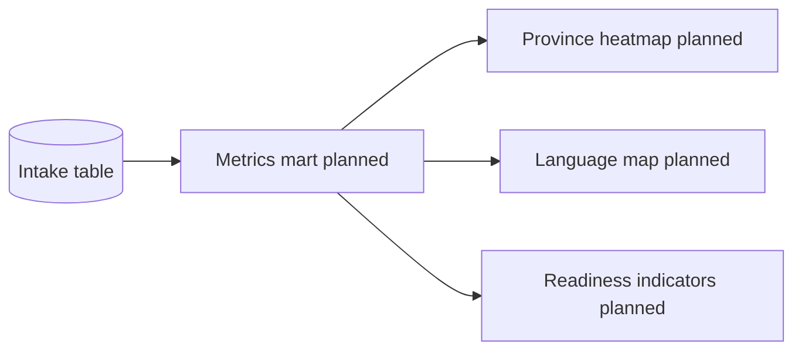

# Internal operational metrics

## Purpose

Define internal metrics used for weekly operational decisions in intake and cohort preparation.

These metrics are not all intended for public publication.

## Internal objectives

- monitor applicant growth pace
- identify regional and language demand shifts
- assess technical readiness profile of applicants
- understand education access constraints (internet/device)
- prioritize review workload and cohort planning

## Intake metrics (operational dataset)

| Domain             | Metric                                | Source field(s)            | Use                               |
| ------------------ | ------------------------------------- | -------------------------- | --------------------------------- |
| Volume             | New applications per day/week         | `created_at`               | Capacity planning                 |
| Growth             | Week-over-week intake change          | `created_at`               | Demand trend                      |
| Regional demand    | Applications by province/municipality | `province`, `municipality` | Geographic prioritization         |
| Language mix       | Primary language distribution         | `primary_language`         | Content and facilitation planning |
| Education profile  | Education-level distribution          | `education_level`          | Curriculum baseline               |
| Interest demand    | Top interest categories               | `areas_of_interest`        | Track prioritization              |
| Access constraints | Internet access profile               | `internet_access_level`    | Offline-first planning            |
| Device constraints | Device access profile                 | `device_access`            | Mobile-first delivery design      |
| Employment context | Employment status distribution        | `employment_status`        | Scheduling and support design     |

## Technical readiness indicators (internal)

Recommended practical indicators from intake text and structured fields:

- self-declared technical background level
- proportion of applicants with GitHub/LinkedIn links
- demand for technical-careers area
- internet/device suitability for technical modules

These are directional indicators, not final admission scores.

## Future dashboard metrics (planned)

| Domain                 | Metric                                  | Status  |
| ---------------------- | --------------------------------------- | ------- |
| Cohort completion      | Completed / enrolled ratio              | Planned |
| Engagement             | Attendance and assignment participation | Planned |
| Retention              | Continued participation over time       | Planned |
| Curriculum demand      | Enrollment by module/track              | Planned |
| Scholarship allocation | Awarded seats by cohort and region      | Planned |

## Visualization ideas (future)

### Province heatmaps

- choropleth by applicant volume
- second layer for access constraints

### Language maps

- province-language matrix
- dominant language by region

### Technical readiness indicators

- stacked bars by readiness segment
- trendline of technical-track demand

## Quality controls

- Validate null/missing fields per extraction run
- Track duplicate suppression logic
- Separate "unknown" from true zero values
- Version metric definitions before changing formulas

## Weekly internal review template

1. Intake volume and growth
2. Regional demand shifts
3. Access constraints and delivery implications
4. Technical readiness profile
5. Actions for admissions, curriculum, and outreach

## Related

- [reporting-framework.md](reporting-framework.md)
- [outcomes-framework.md](outcomes-framework.md)
- [../operations/admin-dashboard-planning.md](../operations/admin-dashboard-planning.md)
