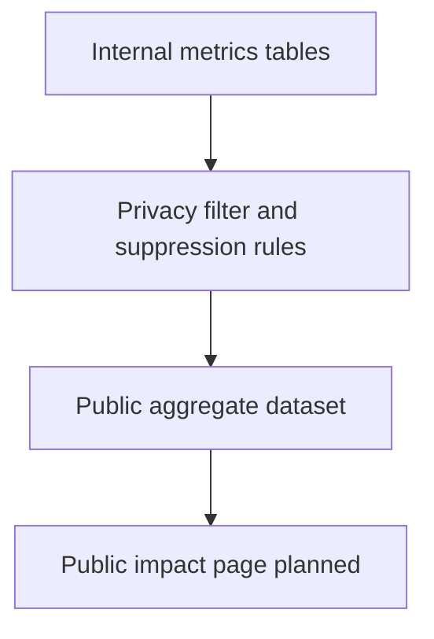

# Public impact metrics

## Purpose

Define what BIU.G Academy can publish publicly to demonstrate progress without exposing personal data or making inflated claims.

## Public reporting constraints

- No personal identifiers
- No publication of raw applicant records
- No province-level disclosure if sample size is too small
- No guaranteed-outcome claims tied to metrics

## Public metric set (recommended)

| Category                 | Public metric                            | Notes                              |
| ------------------------ | ---------------------------------------- | ---------------------------------- |
| Intake reach             | Total applications received (period)     | Aggregate only                     |
| Regional demand          | Applications by province (top-level)     | Suppress very small counts         |
| Language distribution    | Preferred language share                 | PT/EN/FR and other                 |
| Education access pattern | Internet access and device access shares | Helps explain delivery constraints |
| Curriculum demand        | Areas of interest ranking                | High-level category counts         |
| Program progression      | Cohorts launched and active              | No participant-level details       |
| Completion               | Cohort completion rate (when available)  | Future, after cohorts run          |
| Scholarship transparency | Number of scholarship-supported seats    | Future, policy-aligned             |

## Public dashboard plan (future)

## Suppression and thresholds

Recommended public rule set:

- Do not publish categories with fewer than 10 observations
- Group low-volume categories as "Other"
- Publish percentages with clear denominator notes

## Narrative standards

Public metric narratives should:

- use neutral institutional language
- explain data period and context
- avoid promotional exaggeration
- state what is operational vs planned

## Suggested publication cadence

| Output                      | Cadence   | Status  |
| --------------------------- | --------- | ------- |
| Public impact snapshot      | Quarterly | Planned |
| Annual transparency summary | Annual    | Planned |

## Example public indicator layout

1. Applications received this quarter
2. Provincial demand distribution
3. Language preference distribution
4. Device and connectivity access profile
5. Interest areas in highest demand
6. Program progression and next milestones

## Related

- [reporting-framework.md](reporting-framework.md)
- [internal-operational-metrics.md](internal-operational-metrics.md)
- [../governance/transparency-policy.md](../governance/transparency-policy.md)
