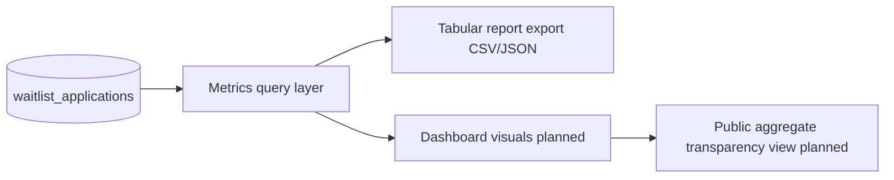

# Reporting framework

## Purpose

Define a lightweight, privacy-conscious reporting standard for BIU.G Academy intake and future cohort operations.

This framework supports operational visibility into:

- applicant growth
- regional demand
- technical readiness
- education access patterns
- language distribution

## Reporting principles

| Principle           | Application                                                      |
| ------------------- | ---------------------------------------------------------------- |
| Privacy-first       | Aggregate reporting by default; avoid personal-level publication |
| Non-invasive        | No behavior tracking scripts beyond essential operations         |
| Operational clarity | Prefer metrics that support decisions, not vanity totals         |
| Traceable methods   | Document definitions and data windows for every report           |
| Status discipline   | Separate operational data from planned indicators                |

## Metric layers

### Layer 1 — Waitlist intake metrics (operational as data model)

| Metric                       | Source field(s)     | Reporting level                      |
| ---------------------------- | ------------------- | ------------------------------------ |
| Applicants by province       | `province`          | Province and municipality aggregates |
| Device type distribution     | `device_access`     | Percentage share                     |
| Language preference          | `primary_language`  | Percentage share                     |
| Education level distribution | `education_level`   | Percentage share                     |
| Areas of interest demand     | `areas_of_interest` | Ranked category counts               |
| Intake growth trend          | `created_at`        | Weekly / monthly trend               |

### Layer 2 — Program delivery metrics (future)

| Metric                 | Definition                                            | Status  |
| ---------------------- | ----------------------------------------------------- | ------- |
| Cohort completion      | % of enrolled participants finishing required modules | Planned |
| Engagement             | Attendance, module activity, assignment submission    | Planned |
| Curriculum demand      | Track-level applications and participation            | Planned |
| Retention              | Continued participation across learning periods       | Planned |
| Scholarship allocation | Seats and support distribution by criteria            | Planned |

## Reporting cadence

| Audience               | Report content                          | Cadence             |
| ---------------------- | --------------------------------------- | ------------------- |
| Internal operations    | Intake trends + review queue health     | Weekly              |
| Program leadership     | Regional/language/device demand + risks | Monthly             |
| Public transparency    | High-level aggregate impact indicators  | Quarterly or annual |
| Institutional partners | Agreed dashboard extracts by agreement  | As agreed           |

## Data windows and comparability

Standard windows:

- rolling 7 days (operational monitoring)
- rolling 30 days (intake trend)
- quarter-to-date (institutional review)

Every report should include:

- reporting period
- data extraction timestamp
- inclusion/exclusion notes
- known quality limitations

## Minimum report template

1. Summary (3 to 5 bullets)
2. Intake volume and growth
3. Regional and language distribution
4. Access constraints (internet/device)
5. Demand by interest category
6. Risks and operational actions

## Visualization architecture plan

This keeps reporting lightweight: SQL + exports first, visualization second.

## Governance and review

- Metrics definitions owned by operations and documentation maintainers
- Any public metric must be reviewed for re-identification risk
- Method changes should be logged in changelog or report notes

## Related

- [outcomes-framework.md](outcomes-framework.md)
- [internal-operational-metrics.md](internal-operational-metrics.md)
- [public-impact-metrics.md](public-impact-metrics.md)
- [../operations/intake-system.md](../operations/intake-system.md)
