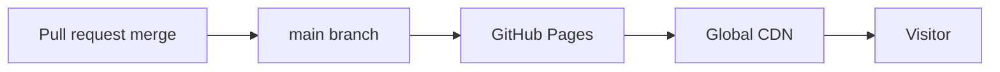

# Deployment guide

Deployment model for the BIU.G Academy **static public site**. Backend/LMS deployments are **planned** and not covered as operational procedures.

---

## GitHub Pages deployment (operational)

### Prerequisites

- Repository hosted at `biu-gholdings/biugacademy-web`
- GitHub Pages enabled for default branch (`main`)
- Source: **Deploy from branch** → `/ (root)`

### Deploy process

1. Merge changes to `main`
2. GitHub Pages builds and publishes static files (typically within minutes)
3. Verify at `https://biugacademy.org` and `https://<org>.github.io/biugacademy-web/`

No build command is required for the static site. The repository root includes `.nojekyll` so GitHub Pages publishes HTML/CSS/JS as-is and does not run Jekyll over institutional markdown templates.

---

## Domain configuration (operational)

| Item          | Location                                                           |
| ------------- | ------------------------------------------------------------------ |
| Custom domain | `CNAME` file → `biugacademy.org`                                   |
| DNS           | Registrar points to GitHub Pages (A/AAAA or CNAME per GitHub docs) |
| HTTPS         | Enforced in GitHub repository Pages settings                       |

Detail checklist: see repository `CNAME` and GitHub **Settings → Pages**.

---

## Environment handling

| Environment    | Purpose                                         |
| -------------- | ----------------------------------------------- |
| **Production** | GitHub Pages → biugacademy.org                  |
| **Local**      | `python3 -m http.server` or any static server   |
| **Preview**    | PR review via local clone or future CI artifact |

### Secrets

- **Never** commit `.env`, API keys, or intake credentials
- Configure intake bridges (e.g. Google Apps Script) in provider consoles
- See `backend/.env.example` for local experiments only

---

## Static export process

The site **is** static HTML/CSS/JS—there is no separate export step today.

| Action         | Command / note                              |
| -------------- | ------------------------------------------- |
| Local preview  | `python3 -m http.server 8080`               |
| Validate links | Manual or future CI link checker (planned)  |
| Asset check    | Ensure paths are root-relative (`/css/...`) |

---

## CI/CD expectations

| Check                                 | Status                                                             |
| ------------------------------------- | ------------------------------------------------------------------ |
| GitHub Pages deploy on push to `main` | **Operational** (platform)                                         |
| Markdown lint workflow                | **Under development** (`.github/workflows/docs-lint.yml`)          |
| HTML/CSS automated tests              | **Planned**                                                        |
| PDF build on release tag              | **Planned** — see [pdf-export-pipeline.md](pdf-export-pipeline.md) |

### Maintainer checklist per release

1. Review regulatory copy on touched locale pages
2. Confirm no secrets in diff
3. Smoke-test `/pt/`, intake, and thank-you paths locally
4. Update [CHANGELOG.md](../../CHANGELOG.md) for notable releases

---

## Rollback

Revert the merge commit on `main` or restore files from a known tag. Pages will republish automatically.

---

## Related

- [../../ARCHITECTURE.md](../../ARCHITECTURE.md)
- [pdf-export-pipeline.md](pdf-export-pipeline.md)
- [../architecture/website-architecture.md](../architecture/website-architecture.md)
