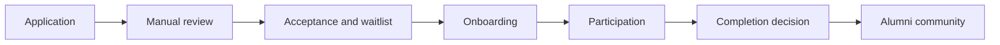
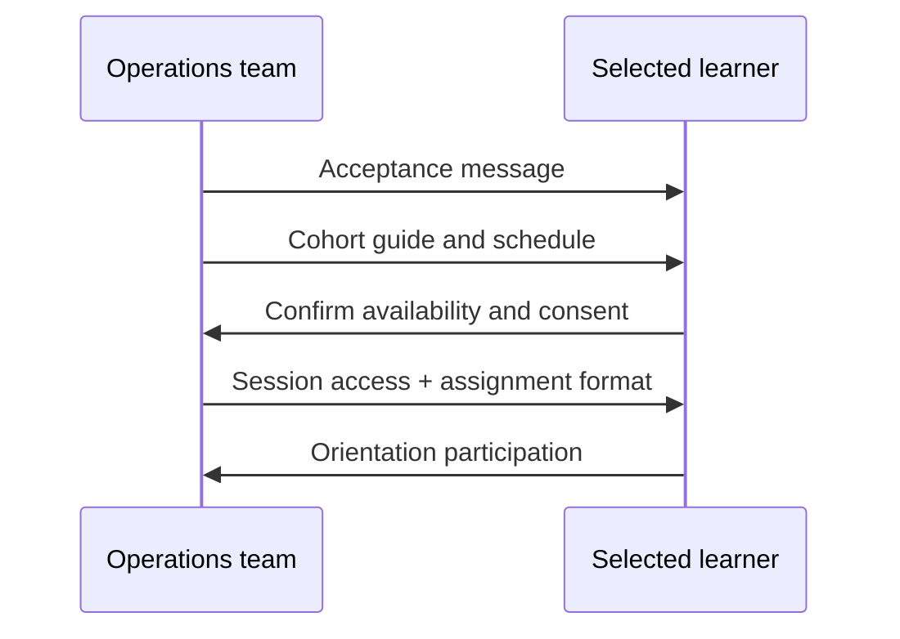
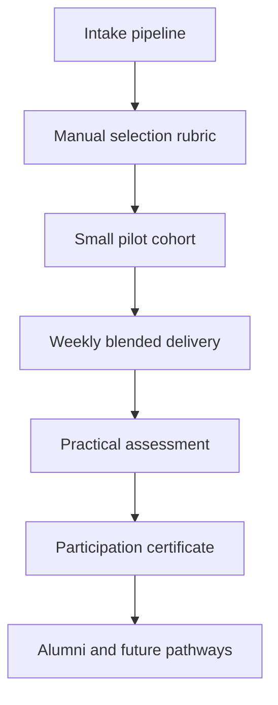

# First cohort execution

## Status

This is an execution design for the **first planned BIU.G Academy pilot cohort**. It does not indicate that a cohort has already run.

## 1) Cohort structure

### Pilot parameters

| Component          | Pilot design                                                  |
| ------------------ | ------------------------------------------------------------- |
| Cohort size        | 30 to 50 learners (small and manageable)                      |
| Duration           | 8 weeks                                                       |
| Format             | Blended: low-bandwidth online + practical offline assignments |
| Live sessions      | 1 group session per week (60 to 90 min)                       |
| Mentor interaction | 1 mentor for every 10 to 15 learners (group-first support)    |
| Assessment logic   | Participation + practical tasks + final applied exercise      |

### Delivery model

- Mobile-first learning materials (short lessons, text-first)
- Offline-capable assignments (downloadable or message-based instructions)
- Weekly rhythm to maintain consistency without overloading participants

## 2) Selection framework

Selection remains human-reviewed and rubric-based.

| Criterion           | Practical interpretation                                    |
| ------------------- | ----------------------------------------------------------- |
| Motivation          | Clear reason to join and complete practical work            |
| Commitment          | Availability for weekly participation                       |
| Accessibility       | Can engage with mobile and limited bandwidth context        |
| Regional inclusion  | Broad province representation where feasible                |
| Technical readiness | Baseline ability appropriate for beginner-friendly pathways |

### Recommended rubric (pilot)

| Criterion                    | Weight |
| ---------------------------- | ------ |
| Motivation                   | 30%    |
| Commitment/availability      | 25%    |
| Accessibility fit            | 20%    |
| Regional inclusion objective | 15%    |
| Technical readiness baseline | 10%    |

## 3) Curriculum outline (pilot)

The pilot uses practical foundational modules:

| Module                  | Focus                                       | Outcome                                                     |
| ----------------------- | ------------------------------------------- | ----------------------------------------------------------- |
| Financial literacy      | Budgeting, debt awareness, savings behavior | Basic household and micro-business financial discipline     |
| Digital literacy        | Core digital practices and communication    | Confident use of essential digital tools                    |
| AI readiness            | Responsible AI usage basics                 | Practical prompt/use/verification habits                    |
| Internet productivity   | Low-bandwidth productivity workflows        | Better learning and work output in constrained connectivity |
| Entrepreneurship basics | Small business fundamentals                 | Early-stage planning and execution discipline               |

### Weekly architecture (example)

1. Orientation and baseline
2. Financial literacy fundamentals
3. Financial practice and habit design
4. Digital literacy fundamentals
5. Internet productivity in constrained environments
6. AI readiness basics
7. Entrepreneurship basics
8. Final practical exercise and reflection

## 4) Student lifecycle

### Lifecycle stages

| Stage         | Operational action                                               |
| ------------- | ---------------------------------------------------------------- |
| Application   | Candidate submits structured intake form                         |
| Review        | Manual rubric scoring and shortlist                              |
| Acceptance    | Selected candidates receive onboarding instructions              |
| Onboarding    | Orientation, expectations, schedule, communication channel setup |
| Participation | Weekly sessions + assignments + mentor support                   |
| Completion    | Practical participation verification and final project review    |
| Alumni        | Continued access to updates and future pathways                  |

### Onboarding flow

## 5) Mentor interaction model

- Group mentor office hours once per week
- Structured Q&A and practical assignment feedback
- Escalation path for learners needing extra support
- Mentor notes kept concise for operational continuity

## 6) Assessment logic

Pilot assessment emphasizes practical completion, not high-stakes exams.

| Component              | Suggested weight |
| ---------------------- | ---------------- |
| Session participation  | 30%              |
| Weekly practical tasks | 40%              |
| Final applied exercise | 30%              |

Completion decision should combine attendance, assignment consistency, and practical demonstration.

## 7) Certification philosophy

Pilot recognition should be explicit and conservative:

- **Educational participation certificate only**
- **Not an accredited academic degree**
- Recognition of practical participation and completion of pilot requirements

Recommended certificate wording:

> Certificate of participation and practical completion in BIU.G Academy pilot cohort activities.

## 8) Future scaling notes (post-pilot)

| Area                       | Next-step direction                                                  |
| -------------------------- | -------------------------------------------------------------------- |
| Provincial ambassadors     | Local support points for outreach and learner retention              |
| Mentor expansion           | Increase mentor pool with train-the-mentor standards                 |
| Institutional partnerships | Structured collaboration with NGOs/universities after pilot evidence |

Scaling must remain documentation-first and quality-controlled.

## 9) Cohort architecture summary

## Related

- [first-cohort-plan.md](first-cohort-plan.md)
- [admissions-framework.md](admissions-framework.md)
- [cohort-selection.md](cohort-selection.md)
- [quality-standards.md](quality-standards.md)
