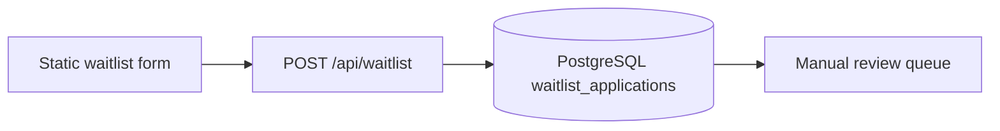
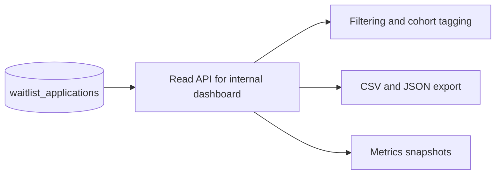

# Intake system

## Purpose

Define a production-ready, backend-capable waitlist intake flow for BIU.G Academy while keeping the current frontend lightweight and mobile-first.

## Current architecture

### Characteristics

- Mobile-first static form on GitHub Pages
- Lightweight Node/Express endpoint (`backend/server.js`)
- PostgreSQL persistence (`backend/schema.sql`)
- Rate limiting and honeypot-aware submission handling
- Redirect to `/thank-you/` after successful submission

## Data flow

1. Applicant completes required fields on waitlist form.
2. Client-side validation runs (required fields, email, phone, minimum motivation length).
3. Hidden metadata is attached:
   - `browser_language`
   - `timezone`
   - `referral_source`
   - `submission_timestamp`
4. Frontend submits JSON to `/api/waitlist`.
5. Backend validates and normalizes payload:
   - province normalization
   - phone normalization
   - empty/honeypot rejection path
6. Backend checks duplicate email/phone.
7. Backend stores structured row in PostgreSQL.
8. Response returns `{ ok: true, status: "received" }`.
9. Frontend redirects to `/thank-you/`.

## Structured intake schema

Core fields in `waitlist_applications`:

- `full_name`
- `email`
- `phone_number`
- `whatsapp_number`
- `province`
- `municipality`
- `age_range`
- `primary_language`
- `education_level`
- `areas_of_interest` (JSON array)
- `technical_background`
- `internet_access_level`
- `device_access`
- `employment_status`
- `linkedin_optional`
- `github_optional`
- `motivation_statement`
- `consent_checkbox`
- `source_platform`
- `created_at`

Metadata fields:

- `browser_language`
- `timezone`
- `referral_source`
- `submission_timestamp`

## Anti-spam controls

### Active now

- Honeypot hidden field (`website`)
- API rate limiting (`express-rate-limit`)
- Server-side validation with Zod

### Duplicate prevention

- Duplicate email check (`lower(email)`)
- Duplicate phone check (`phone_number`)
- Index support in PostgreSQL for both fields

### Next step (planned)

- Optional edge rate limiting (Cloudflare or reverse proxy)
- IP reputation and abuse scoring
- Challenge-based protection only if spam rises (to preserve low-bandwidth UX)

## Future admin dashboard pipeline

Initial dashboard will stay manual-first (no automatic acceptance decisions).

## Analytics direction (planned)

- Applicant volume by province/municipality
- Language segmentation
- Internet/device constraints for delivery planning
- Cohort readiness indicators by interest area

See [../metrics/outcomes-framework.md](../metrics/outcomes-framework.md).

## AI classification direction (future layer)

AI can be added later as an assistive layer:

- Candidate summarization
- Priority suggestion for manual review
- Suggested cohort tags

Constraints:

- Human-in-the-loop decisions only
- No autonomous admissions
- No opaque scoring used as sole gate

## Operational notes

- Keep payload size small and text-only for low bandwidth.
- Do not add heavy client-side frameworks.
- Maintain strict status language: operational vs planned.
