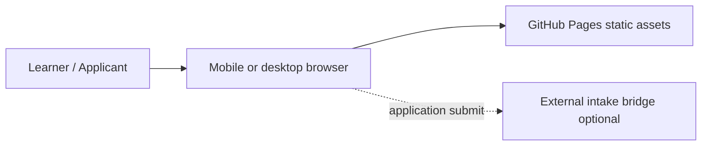
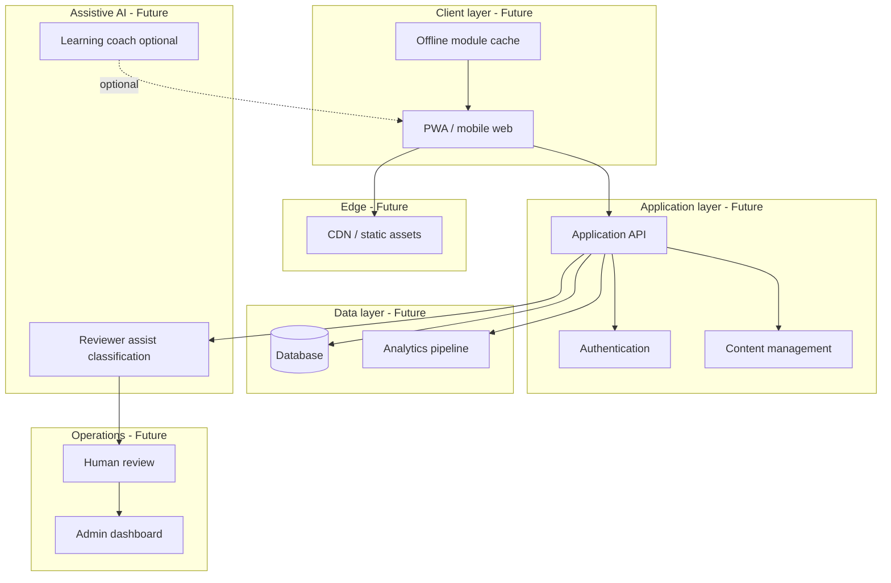
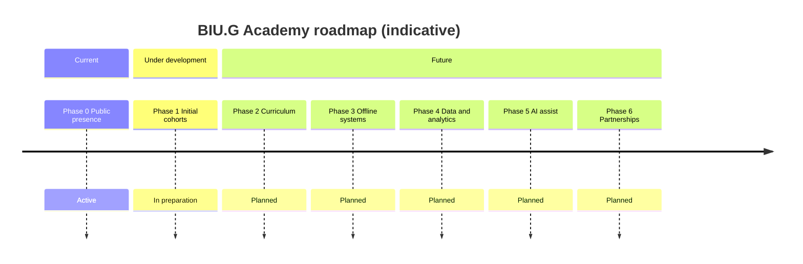

# BIU.G Academy: Building Human Capital Infrastructure for Angola’s Digital Future

**Version 1.0 — Strategic White Paper**

Prepared by **Fabio Guilherme Massanga**  
Founder & Executive Director – BIU.G Academy  
Founder & CEO – Biu-g Holdings LLC

**Website:** [https://biugacademy.org](https://biugacademy.org)  
**Contact:** [support@biugacademy.org](mailto:support@biugacademy.org)

---

## Document status key

Throughout this paper, capabilities are labeled:

| Label | Meaning |
|-------|---------|
| **Current** | Live or actively maintained today |
| **Under development** | In design, pilot, or partial implementation |
| **Future (planned)** | Roadmap intent; not operational |

---

# — Cover —

  

## BIU.G Academy

### Building Human Capital Infrastructure for Angola’s Digital Future

 

**Version 1.0 — Strategic White Paper**

 

Prepared by Fabio Guilherme Massanga  
Founder & Executive Director, BIU.G Academy  
Founder & CEO, Biu-g Holdings LLC

 

May 2026

 

[biugacademy.org](https://biugacademy.org)

  

*This document is for institutional orientation. It does not constitute an offer, regulatory filing, or accredited academic prospectus.*

---

## Table of contents

1. [Executive Summary](#1-executive-summary)
2. [National Context](#2-national-context)
3. [Strategic Thesis: Human Capital as National Infrastructure](#3-strategic-thesis-human-capital-as-national-infrastructure)
4. [Mission & Principles](#4-mission--principles)
5. [Platform Objectives](#5-platform-objectives)
6. [Audience Segmentation](#6-audience-segmentation)
7. [Product Architecture](#7-product-architecture)
8. [Curriculum Philosophy](#8-curriculum-philosophy-practical-education-for-the-real-economy)
9. [Regulatory Positioning](#9-regulatory-positioning)
10. [Technology Philosophy](#10-technology-philosophy-technology-must-adapt-to-local-reality)
11. [Governance & Transparency](#11-governance--transparency)
12. [Sustainability Model](#12-sustainability-model)
13. [Implementation Roadmap](#13-implementation-roadmap)
14. [Risk Factors](#14-risk-factors)
15. [Long-Term Vision](#15-long-term-vision)
16. [Appendices](#16-appendices)

---

## 1. Executive Summary

Angola faces a structural gap between national development ambitions and the practical skills available in the workforce. Youth represent a large share of the population, yet pathways into stable employment, digital participation, and technical execution remain uneven—especially outside major urban centers. Financial stress, informal livelihoods, and limited connectivity shape how people can learn, not only what they are willing to learn.

**BIU.G Academy** is a technical education and training initiative **under development**, founded to address this gap through **Angola-first**, **offline-first**, and **practical-first** learning infrastructure. The initiative is being built by Biu-g Holdings LLC with a long-term orientation toward institutional capacity—not a single product launch.

### What exists today (Current)

- A public informational website at [biugacademy.org](https://biugacademy.org), deployed as a static site on GitHub Pages
- Multilingual public pages (Portuguese primary; English and French present with ongoing parity work)
- Candidate intake pathways for a **planned** first cohort (application flow; cohort not yet completed)
- Institutional documentation and governance artifacts in the public repository

### What is being built (Under development / Future)

- Structured curriculum for practical financial literacy, digital readiness, entrepreneurship foundations, technical pathways, and AI-native learning literacy
- Operational models for cohort delivery, quality assurance, and reviewer-led admissions
- Progressive platform capabilities (learning management, offline access, analytics, assistive AI for reviewers—**none of which are production-complete today**)

### Why this matters

Practical education infrastructure is economic infrastructure. Nations that invest only in hardware and policy without cultivating builders, operators, analysts, educators, and disciplined small-business operators limit their ability to absorb technology productively. BIU.G Academy’s thesis is that **human capital development must be designed for Angola’s real conditions**—mobile usage, intermittent connectivity, multilingual needs, and informal economic participation—while maintaining regulatory discipline and educational integrity.

This white paper is intended for developers, educators, regulators, NGOs, universities, future donors, and strategic collaborators evaluating BIU.G Academy’s direction. It distinguishes clearly between **current capability**, work **under development**, and **future roadmap** items.

---

## 2. National Context

### 2.1 Demographic and labor market pressure

Angola has a **comparatively young population**. A significant share of citizens are under 25, which creates both opportunity and urgency: the country’s future productivity depends on how well young people transition from education into economically useful capability. Public reports and labor market analyses commonly cite **elevated youth unemployment and underemployment**, including skills mismatches between formal training and employer needs. BIU.G Academy does not claim to solve national unemployment; it aims to contribute **practical pathways** at meaningful scale over time.

### 2.2 Technical and digital skills gap

Digital transformation in government, finance, logistics, energy, and services requires people who can **use**, **maintain**, and **build** digital systems—not only consume them. Angola’s technical talent pool is growing, but demand for digital operations, data literacy, cybersecurity awareness, and software-related roles often outpaces structured, accessible preparation—particularly for learners without university pathways or stable internet.

### 2.3 Digital literacy and connectivity realities

Mobile connectivity has expanded access, yet **bandwidth cost, reliability, and device constraints** remain material barriers. Education models that assume always-on video streaming, cloud-only materials, or desktop-first workflows exclude large segments of the population. **Offline-first and mobile-first design** are not optional features for national reach; they are baseline requirements.

### 2.4 Infrastructure disparities

Urban centers and rural provinces experience different levels of access to power, connectivity, facilitators, and institutional partners. Any national education initiative must plan for **uneven infrastructure**, not treat Angola as a single homogeneous connectivity profile.

### 2.5 Informal economy realities

A substantial portion of economic activity occurs in informal and semi-formal work: market trade, small services, household enterprises, and gig-style income. Financial literacy, record-keeping, pricing discipline, and digital tools for communication and payments are directly relevant to stability and growth in this segment—often more immediately than advanced technical certification.

### 2.6 Limited practical workforce alignment

Traditional credentials matter, but employers and communities also need **demonstrated practical ability**: budgeting, customer communication, basic digital fluency, problem-solving, and reliability. Where training emphasizes theory without applied practice, graduates may remain unprepared for real economic participation.

### 2.7 Why practical education infrastructure matters for growth

Economic growth in a digital era depends on:

- **Productivity** — people using tools effectively
- **Entrepreneurship** — stable micro-business formation and survival
- **Institutional execution** — governments and firms implementing systems with competent staff
- **Innovation absorption** — local capacity to adopt and adapt technology responsibly

Without distributed practical education, digital investments risk low utilization, vendor dependency, and weak domestic execution capacity. BIU.G Academy is being designed as **long-horizon human capital infrastructure**—complementary to universities, vocational institutions, NGOs, and employer training—not a replacement for them.

*Note: National statistics should be verified against official sources (e.g., INE Angola, ministry publications) before use in formal regulatory submissions.*

---

## 3. Strategic Thesis: Human Capital as National Infrastructure

### 3.1 Thesis statement

**Human capital is national infrastructure.** Just as roads, power, and telecommunications enable economic activity, a population’s collective skills enable a nation to design, operate, and sustain modern systems.

### 3.2 Sovereign technology requires technical talent

Nations cannot build or govern **sovereign technology capability**—payment systems, identity platforms, data governance, critical digital services—without people who understand how those systems work in practice. Infrastructure without operators, analysts, auditors, and educators becomes fragile and externally dependent.

### 3.3 Education as economic infrastructure

Education is not only a social good; it is **productive capacity**. Practical training that improves financial decision-making, digital participation, and technical readiness can affect household stability, business survival, and public-sector execution—especially when aligned with local context.

### 3.4 Digital readiness and productivity

Digital readiness influences how efficiently individuals and firms adopt tools for communication, record-keeping, commerce, and compliance. The relationship to GDP is complex and mediated by institutions, but the directional link between **skills and productive use of technology** is well established in development economics.

### 3.5 Local talent compounds national capability

Each skilled operator, teacher, mentor, and builder can train others. Talent compounds when pathways are **accessible**, **credible**, and **practical**—not reserved for a narrow elite with perfect connectivity.

### 3.6 Angola needs execution capacity

Angola needs more than consumers of technology. It needs:

| Role category | Contribution |
|---------------|--------------|
| **Builders** | Software, integrations, local solutions |
| **Operators** | Run systems reliably day to day |
| **Analysts** | Interpret data for decisions |
| **Educators** | Transmit practical knowledge at scale |
| **Entrepreneurs** | Create livelihoods and services |
| **Disciplined participants** | Financial and digital habits that reduce fragility |

BIU.G Academy’s strategic role is to **develop pathways** toward this capacity over time—starting with foundational literacy and expanding toward technical and ecosystem readiness **under development**.

---

## 4. Mission & Principles

### 4.1 Mission (institutional)

To develop **Angola-first**, **offline-first**, practical education and training that strengthens financial literacy, digital readiness, technical skills, entrepreneurship foundations, and long-term workforce participation—with integrity, accessibility, and regulatory discipline.

### 4.2 Institutional principles

| Principle | Definition | Status |
|-----------|------------|--------|
| **Angola-first** | Design for Angolan economic, linguistic, and connectivity context first | Active in public positioning |
| **Offline-first** | Learning and platforms must function under constrained connectivity | Under development in curriculum/platform |
| **Mobile-first** | Primary experience optimized for smartphones | **Current** (static site) |
| **Practical-first** | Emphasize applied skills and real-economy outcomes | Under development (curriculum) |
| **Accessibility** | Readable, inclusive design; progressive enhancement | **Current** (baseline); improving |
| **Affordability** | Seek low-cost access models; avoid predatory pricing | Future program design |
| **Multilingual inclusion** | Portuguese primary; English secondary; French later | **Current** (PT/EN/FR pages); parity ongoing |
| **Long-term thinking** | Build institutional documentation and governance early | **Current** (repository docs) |
| **Ethical technology adoption** | Teach responsible AI and digital tool use; human oversight | Under development |

---

## 5. Platform Objectives

### 5.1 Current objectives

| Objective | Description | Status |
|-----------|-------------|--------|
| Public website | Credible institutional presence at biugacademy.org | **Current** |
| Informational content | Mission, program direction, regulatory notices | **Current** |
| Candidate intake | Application / waitlist flow for planned first cohort | **Current** (intake path); cohort **not completed** |
| Educational ecosystem building | Documentation, curriculum frameworks, contributor norms | **Under development** |
| Multilingual public communication | PT / EN / FR surfaces | **Current** (ongoing quality work) |

### 5.2 Future objectives (planned — not operational)

| Objective | Description | Target phase (indicative) |
|-----------|-------------|---------------------------|
| Learning Management System (LMS) | Structured modules, progress tracking | Phase 2–3 |
| Certification models | Non-degree certificates; any accredited pathway only if formally established | Phase 2+ |
| Admin dashboards | Cohort and application management | Phase 3–4 |
| Offline access | Downloadable modules, sync when connected | Phase 3 |
| Scholarship systems | Needs-based access mechanisms | Phase 6 |
| Mentor ecosystem | Volunteer/professional mentor matching | Phase 6 |
| AI-assisted personalization | Assistive learning and **reviewer support**; not autonomous admissions | Phase 5 |

**Explicit exclusion (Current):** BIU.G Academy does not operate production financial services, token platforms, or wallet infrastructure from this education repository.

---

## 6. Audience Segmentation

BIU.G Academy is being designed for multiple segments. Delivery depth and sequencing will vary; not all segments are served at launch.

| Segment | Needs | Academy response (planned / under development) |
|---------|-------|-----------------------------------------------|
| **Students & young adults** | Skills, direction, employability | Foundational literacy → digital → technical pathways |
| **Rural youth** | Low connectivity, limited institutions | Offline-first modules; mobile delivery |
| **Women entrepreneurs** | Financial control, business stability | Financial literacy + entrepreneurship modules |
| **Teachers & facilitators** | Train-the-trainer materials | Future facilitator guides |
| **Informal workers** | Cash flow, pricing, digital tools | Practical financial + digital modules |
| **Technical beginners** | Structured on-ramps | Progressive technical readiness track |
| **Institutions** | Partnership, curriculum alignment | Future partnership framework (no implied deals today) |
| **NGOs** | Complementary delivery, reach | Documented interoperability goals |
| **Workforce pipelines** | Employer-aligned skills | Future advisory input; not operational |

**First cohort focus (Under development):** practical financial literacy for motivated applicants, with Angola-based priority described on the public site.

---

## 7. Product Architecture

### 7.1 Current stack

| Layer | Technology / approach | Status |
|-------|-------------------------|--------|
| Hosting | GitHub Pages (static) | **Current** |
| Frontend | HTML, CSS, vanilla JavaScript | **Current** |
| Domain | biugacademy.org (`CNAME`) | **Current** |
| i18n | Locale paths `/pt/`, `/en/`, `/fr/` | **Current** |
| Intake | Form submission to external bridge (e.g. serverless script) | **Current** (config-dependent) |
| Build tooling | None required for deploy | **Current** |

#### Current architecture (diagram)

### 7.2 Planned infrastructure (Future — not operational)

| Layer | Planned capability |
|-------|-------------------|
| Authentication | Secure learner and admin accounts |
| CMS | Managed content publishing with review workflow |
| Application API | Persistent, privacy-conscious application storage |
| Analytics | Privacy-bounded usage and outcome metrics |
| PWA | Installable, cache-friendly web app shell |
| Offline sync | Module download and progress sync |
| Dashboards | Admissions, cohorts, facilitator tools |
| AI recommendation engine | **Assistive** suggestions; human decisions retained |

#### Planned architecture (diagram)

### 7.3 Repository alignment

Technical documentation for the live site lives in the public repository (`docs/architecture/`, `docs/deployment/`). Experimental backend code, if present, is **not** production infrastructure until promoted on the institutional roadmap.

---

## 8. Curriculum Philosophy: Practical Education for the Real Economy

### 8.1 Philosophy statement

Learning must **transfer to action** in Angola’s real economy: households, markets, small enterprises, public interaction with digital services, and—over time—technical roles. Theory supports practice; it does not replace it.

### 8.2 Learning domains (Under development unless noted)

| Domain | Focus | Cohort priority |
|--------|-------|-----------------|
| **Financial literacy** | Budgeting, debt awareness, savings, income planning, micro-business cash flow | **First planned cohort** |
| **Digital literacy** | Device safety, productivity tools, professional communication | Planned expansion |
| **Entrepreneurship** | Validation, pricing, customer relations, basic compliance awareness | Planned expansion |
| **Technical readiness** | Problem-solving, career orientation, contributor literacy | Planned expansion |
| **AI-native learning** | Responsible tool use, verification habits, future-of-work literacy | Planned expansion |
| **Practical execution** | Assignments tied to real tasks, not abstract assessment only | Cross-cutting |
| **Local context adaptation** | Angolan examples, language, connectivity constraints | Cross-cutting |

### 8.3 Delivery standards (Under development)

- Short lessons suitable for mobile consumption
- Offline-capable materials where feasible
- Facilitator guides for cohort settings
- Quality review per institutional standards (see repository `docs/operations/quality-standards.md`)

### 8.4 What graduates should not be told

Programs will not promise guaranteed employment, income, loans, investment returns, or accredited degrees **unless explicitly and legally established in the future**.

---

## 9. Regulatory Positioning

### 9.1 Institutional status (strict disclosure)

**BIU.G Academy:**

| Statement | Fact |
|-----------|------|
| Operational maturity | Initiative **under development** |
| University status | **Not** currently a university |
| Accredited degrees | **Does not** currently issue accredited academic degrees |
| Licensing | **Not** claiming licensed status as a higher-education institution or financial institution |
| Program design | Educational frameworks **being designed** with attention to evolving Angolan standards |
| Future pathways | May **explore** partnerships or accreditation routes **where appropriate and lawful**—none claimed today |

### 9.2 Reference frameworks (design attention only)

Program design references **guidance frameworks** associated with:

- **MESCTI** — Ministry of Higher Education, Science, Technology and Innovation ([mescti.gov.ao](https://www.mescti.gov.ao/))
- **INAAREES** — National Institute for Assessment, Accreditation and Recognition of Higher Education Studies ([sepe.gov.ao](https://sepe.gov.ao/))

**This paper does not imply** government approval, accreditation, licensing, inspection outcome, or formal partnership with these bodies.

### 9.3 Communications discipline

All public materials should use: *under development*, *being designed*, *planned*, *progressive development*. Avoid: *approved*, *accredited*, *licensed*, *official partner* without executed agreements and authorized publication.

### 9.4 Data and learner protection

Privacy commitments are documented in `docs/regulatory/data-privacy-position.md`. Production data handling policies will be updated before large-scale personal data processing.

---

## 10. Technology Philosophy: Technology Must Adapt to Local Reality

### 10.1 Principle

Technology for education in Angola must adapt to **local reality**, not expect learners to adapt to idealized infrastructure.

### 10.2 Design commitments

| Challenge | Response |
|-----------|----------|
| Low bandwidth | Lightweight pages; minimal dependencies; **Current** static site practice |
| Offline need | Downloadable modules; sync later (**Future**) |
| Mobile dominance | Mobile-first layout and navigation (**Current**) |
| Multilingual society | PT-first content; EN/FR parity over time (**Current** / ongoing) |
| Accessibility | Semantic HTML, contrast, keyboard focus improvements (**Current** baseline) |
| Usability | Clear CTAs, short forms, practical copy—not marketing noise |

### 10.3 Ethical technology

AI tools, when introduced, will be positioned as **assistive**—supporting learners and human reviewers—with transparency, bias awareness, and oversight. **No production AI admissions engine exists today.**

---

## 11. Governance & Transparency

### 11.1 Current structure

| Element | Status |
|---------|--------|
| Leadership | Founder-led initiative under Biu-g Holdings LLC |
| Execution model | Documentation-first; public repository governance artifacts |
| Advisory bodies | **Future (planned)** — education, technical, and community advisors |
| Decision principles | Accuracy, learner safety, regulatory caution, educational integrity |

### 11.2 Transparency goals (Future aspirations)

- Public roadmap and changelog discipline (**Current** in repository)
- Annual public summary of programs, reach, and outcomes (**Future** — when operational scale warrants)
- Donation and sponsorship reporting if fundraising activates (**Future** — with defined accountability)
- Clear separation of education mission from unrelated corporate activities

### 11.3 Educational integrity

- No false credential claims by staff or contributors
- No exploitative financial promises to learners
- Code of conduct enforced in community spaces (see repository `CODE_OF_CONDUCT.md`)

Corporate ownership, cap table, or investor materials are **out of scope** for this public education document.

---

## 12. Sustainability Model

### 12.1 Orientation

BIU.G Academy intends to pursue **sustainable** delivery without compromising access or integrity. Revenue and funding models are **under exploration**; **no guaranteed financial outcomes** are assumed in this white paper.

### 12.2 Potential revenue and support channels (Future — illustrative)

| Channel | Use of funds (intended) |
|---------|-------------------------|
| Subscriptions | Low-cost learner access tiers where appropriate |
| Donations | Scholarships and content development |
| Sponsorships | Cohort sponsorship with ethical firewall |
| Institutional partnerships | Co-delivery, research, or facility support—only with formal agreements |
| Scholarships | Needs-based access |
| Blended access | Mix of free foundational content and supported cohorts |

### 12.3 Safeguards (planned policy direction)

- Financial conflicts disclosed in partnerships
- No pay-to-win admission schemes
- Donor influence limited on curriculum accuracy and regulatory statements

---

## 13. Implementation Roadmap

Roadmap phases align with repository `ROADMAP.md` with institutional Phase 6 added for partnerships.

| Phase | Name | Focus | Status |
|-------|------|-------|--------|
| **0** | Public Presence | Website, docs, intake foundation | **Active** |
| **1** | Initial Cohorts | Admissions, first cohort delivery | **Under development** |
| **2** | Curriculum Expansion | Modules across core domains | **Planned** |
| **3** | Offline Learning Systems | Download/sync, facilitator kits | **Planned** |
| **4** | Data & Analytics | API, database, dashboards, metrics | **Planned** |
| **5** | AI-assisted Infrastructure | Reviewer assist, optional learning coach | **Planned** — not production |
| **6** | Institutional Partnerships | Universities, NGOs, employers, funders | **Planned** — no implied deals |

---

## 14. Risk Factors

Prospective partners and funders should consider material risks:

| Risk | Description | Mitigation direction |
|------|-------------|-------------------|
| **Internet infrastructure** | Connectivity and cost limit reach | Offline-first content; lightweight site |
| **Affordability** | Learners may lack funds for devices/data | Scholarships; low-bandwidth design |
| **Language barriers** | Multilingual quality takes time | PT-first; reviewed translations |
| **Educational adoption** | Completion requires motivation and time | Practical curriculum; cohort support |
| **Regulatory evolution** | Angolan education rules may change | Conservative public claims; legal review |
| **Operational scaling** | Facilitators and support may lag demand | Phased cohort sizes; quality standards |
| **Funding constraints** | Initiatives may progress slower than planned | Phased roadmap; transparent reporting |
| **Reputation** | Overstatement would damage trust | Strict Current vs Future labeling |

This list is not exhaustive.

---

## 15. Long-Term Vision

Over the long term, BIU.G Academy aspires to contribute to:

- **Angola-first** workforce readiness rooted in local economic reality
- **African technical readiness** through replicable, practical models (after Angola foundations prove sound)
- **Digital workforce preparation** across literacy layers, not only elite technical tracks
- **Institutional capability building** via documentation, partnerships, and educator networks
- **Economic participation** through financial discipline, digital confidence, and entrepreneurship basics
- **Practical opportunity creation**—improving odds, not guaranteeing outcomes

BIU.G Academy does **not** claim it will single-handedly transform national GDP, replace universities, or deliver instantaneous mass employment. Success is measured by **credible, compounding human capital development** over years, with public honesty about progress.

---

## 16. Appendices

### Appendix A — Glossary

| Term | Definition |
|------|------------|
| **Angola-first** | Design priority for Angolan learners and conditions |
| **Offline-first** | Learning viable without continuous connectivity |
| **Cohort** | Time-bounded group of learners admitted through application |
| **Accreditation** | Formal recognition by authorized bodies—not claimed today |
| **Assistive AI** | Human-overseen tooling; not autonomous governance |
| **Human capital infrastructure** | Distributed skills capacity enabling economic execution |

### Appendix B — Proposed platform modules (Future)

| Module | Function |
|--------|----------|
| Learner profile | Progress, language, accessibility preferences |
| Module player | Lessons, assessments, offline cache |
| Admissions | Applications, reviewer workflow |
| Cohort manager | Schedules, communications |
| Facilitator hub | Guides, attendance, feedback |
| Scholarship admin | Awards, eligibility |
| Mentor matching | Structured mentorship (optional) |
| Reporting | Aggregate outcomes (privacy-bounded) |

### Appendix C — Proposed learning categories

1. Financial literacy (foundational)  
2. Digital skills  
3. Entrepreneurship foundations  
4. AI readiness and ethical use  
5. Technical career orientation  
6. Advanced technical tracks (future, advisory-gated)

### Appendix D — Proposed operational model

| Function | Early phase | Mature phase (Future) |
|----------|-------------|------------------------|
| Admissions | Manual review | Reviewer tools + assistive AI |
| Delivery | Facilitator-led cohorts | Blended online/offline |
| Quality | Peer review of content | Continuous improvement loop |
| Support | Email / community channels | Structured help desk |

### Appendix E — Proposed future integrations (no implied partnerships)

Illustrative integration categories only—**not active agreements**:

- NGO learning management handoffs  
- University extension programs  
- Employer trainee pipelines  
- Public digital literacy campaigns  
- Open-source educational tooling  

Any integration will be announced only with executed agreements and privacy review.

---

## Document control

| Field | Value |
|-------|-------|
| Version | 1.0 |
| Date | May 2026 |
| Author | Fabio Guilherme Massanga |
| Next review | Upon Phase 1 cohort launch or material regulatory change |
| Repository path | `docs/whitepaper/biug-academy-whitepaper-v1.md` |

---

*End of white paper*
